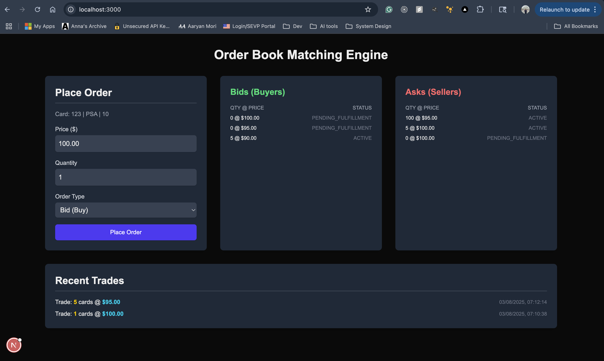
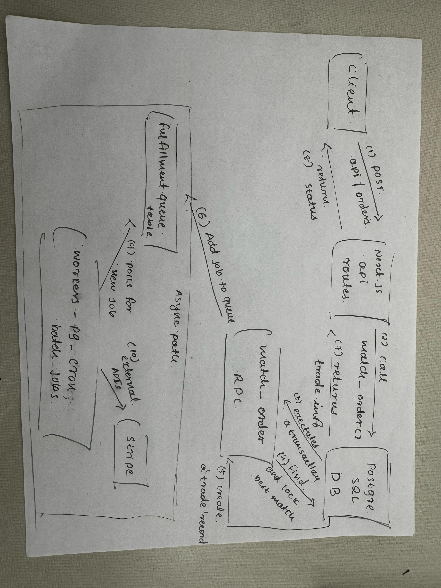

# Technical Design: Order Book Matching Engine

## 1. System Architecture & Data Modeling

### Two-Phase System

To balance **speed**, **data integrity**, and **external latency** (e.g., payment APIs), we designed a hybrid two-phase system:

- **Phase 1: Synchronous Matching (Fast & Atomic)**  
  The critical work of finding and executing a match—including handling partial fills across multiple orders—is handled entirely within a **single atomic PostgreSQL function**.

- **Phase 2: Asynchronous Fulfillment**  
  The result of a successful match (a trade record) triggers a separate, asynchronous process that handles external communications.

## 2. Data Models

### `order_book` Table

Tracks **active live orders**, including support for **quantity** and **partial fills**:

```sql
CREATE TABLE public.order_book (
  id bigserial PRIMARY KEY,
  spec_id bigint NOT NULL,
  grade text NOT NULL,
  grading_company text NOT NULL,
  price numeric(10, 2) NOT NULL,
  type public.order_type NOT NULL, -- 'bid' or 'ask'
  status public.order_status NOT NULL DEFAULT 'active',
  quantity integer NOT NULL DEFAULT 1,
  filled_quantity integer NOT NULL DEFAULT 0,
  created_at timestamp with time zone NOT NULL DEFAULT now()
);
```

### 📄 `trades` Table

An **immutable log** of executions; one order can result in **multiple trades**:

```sql
CREATE TABLE public.trades (
  id bigserial PRIMARY KEY,
  ask_order_id bigint NOT NULL REFERENCES public.order_book(id),
  bid_order_id bigint NOT NULL REFERENCES public.order_book(id),
  execution_price numeric(10, 2) NOT NULL,
  quantity integer NOT NULL,
  fulfillment_status text NOT NULL DEFAULT 'pending'
);
```

## 3. Matching Engine:

### Objective

The `match_order(p_order_id)` function matches a **new incoming order** against opposing orders in the book, while ensuring:

- **Price-Time Priority**
- **Quantity & Partial Fills**
- **Atomic Transactions**
- **Safe Concurrency**

## 4. Core Logic: Price-Time Priority

- **Buy Order (`bid`)**: Match with **lowest-priced** `ask`
- **Sell Order (`ask`)**: Match with **highest-priced** `bid`

```sql
ORDER BY
  CASE WHEN v_order.type = 'bid' THEN price END ASC,
  CASE WHEN v_order.type = 'ask' THEN price END DESC,
  created_at ASC
```

## 5. Functional Steps Breakdown

### Step 1: Lock the Incoming Order

```sql
SELECT * INTO v_order
FROM public.order_book
WHERE id = p_order_id AND status = 'active'
FOR UPDATE;
```

> Prevents other operations on this order during matching.

### Step 2: Matching Loop

```sql
FOR v_match IN SELECT * FROM public.order_book WHERE ...
```

> Iterates over sorted, opposing orders.

### Step 3: Concurrency Guard

```sql
... FOR UPDATE SKIP LOCKED;
```

- **`FOR UPDATE`**: Lock the matched order
- **`SKIP LOCKED`**: Skip already-locked rows to prevent deadlocks

### Step 4: Fill Quantity Calculation

```sql
v_quantity_to_fill := LEAST(
  v_order.quantity - (v_order.filled_quantity + v_cumulative_filled),
  v_match.quantity - v_match.filled_quantity
);
```

> Determines how much of the order can be filled in this match.

### Step 5: Create Trade Record

```sql
INSERT INTO trades (...) VALUES (...) RETURNING id INTO v_trade_id_temp;
```

> Immutable log of the trade.
> Execution price is taken from **resting order** for fairness.

### Step 6: Update Orders

```sql
UPDATE public.order_book SET filled_quantity = ... WHERE id = v_order.id;
UPDATE public.order_book SET filled_quantity = ... WHERE id = v_match.id;
```

> Updates the progress of both matched orders.

### Step 7: Final Status Update

```sql
UPDATE public.order_book
SET status = 'pending_fulfillment'
WHERE status = 'active' AND quantity <= filled_quantity;
```

> Marks fully filled orders as ready for async fulfillment.

## 6. Implementation & Trade-offs

### Stack Used

- **Frontend**: Next.js (App Router)
- **Backend Logic**: API routes (`/api/orders/route.ts`)
- **Core Matching Engine**: PostgreSQL stored procedure (`match_order`)
- **Async Fulfillment**: Vercel Cron Job calls API endpoint polling for `pending_fulfillment` trades

## 7. Future-Proofing & Scaling

### If We Can Add Tools...

- **Redis** (first choice)

  - **Message Queue**: Push-based queue for async workers
  - **Cache Layer**: Fast retrieval of market depth, summary data

- **Dedicated TypeScript Backend (e.g., NestJS)**
  For queue processing, fulfillment workers, email/webhook handling, etc.

### Scaling for Temporal Consistency

#### Apache Kafka

- The ultimate solution is Apache Kafka. By creating a **Kafka topic** partitioned by `spec_id`, all orders for a specific card are forced into a single queue. A dedicated matching engine can then consume from this queue in a strict, sequential order, guaranteeing that orders are processed in the exact sequence they were received, even with 10,000s of requests per second.

## Screenshot



## High - Level Design


